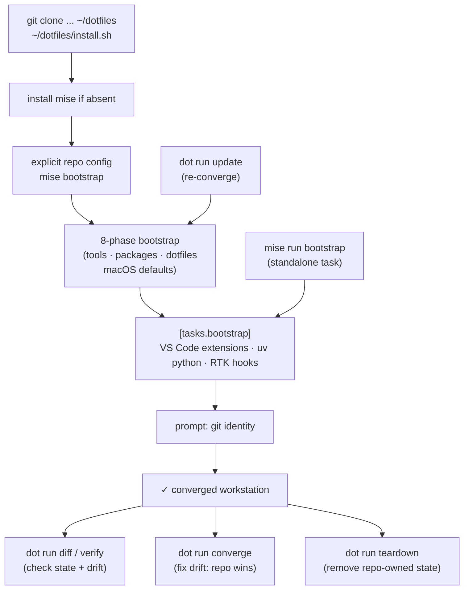
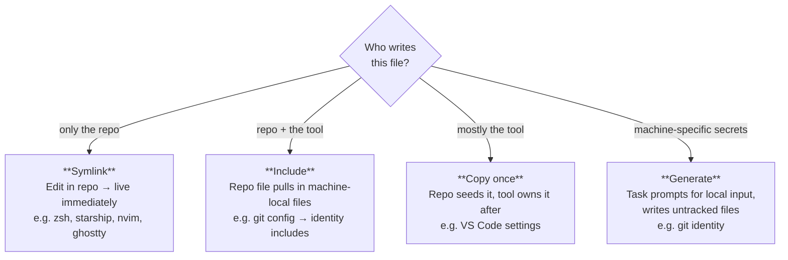
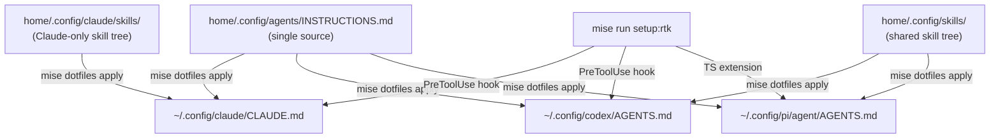

# Architecture

## Control plane

mise is the only user-facing machine and package management interface. Native
package managers (Homebrew) exist behind mise package resources but are never
invoked directly by scripts, tasks, or CI workflows.

## Two mise files, one clear boundary

| File | Scope | Owns |
|---|---|---|
| `home/.config/mise/config.toml` | **Machine state** | Tool versions, package resources, macOS defaults, dotfile mappings, mise bootstrap settings, bootstrap hooks |
| `mise.toml` | **Repository workflow** | Development tasks (test, lint, verify, update, bootstrap), task discovery paths |

Development-only tools belong in the repository `mise.toml`. Workstation-wide
tools and applications belong in the global config.

Shell startup is deliberately separate from the machine declaration:
`.zshenv` owns the early XDG, agent-root, and path bootstrap; `.zprofile` owns
login-shell mise shims; and `.zshrc` owns interactive mise activation, user
environment defaults, aliases, functions, and optional integrations. The global
config keeps only mise/package-manager environment needed to converge the host.

## Sources of truth

- `home/.config/mise/config.toml` + `mise.lock`: desired machine state.
- `home/`: repository-owned `$HOME` content. Most entries are symlinked by
  mise dotfiles; agent instructions and skills are copy-managed.
- `tasks/setup/`: idempotent generators for machine-local state.
- `scripts/`: operational checks and helpers.
- `tests/`: repository correctness validation.

## Lifecycle

Drift is split by intent, not by resource: `dot run diff` reports drift across
every copy-managed resource (symlink dotfiles, copy-mode dotfiles, and VS Code
profiles/extensions) and `dot run converge` fixes it. The model is push-only -
the repo is the sole authority and `converge` overwrites live edits with no
merge. mise's history (`save`/`watch`) and cross-machine sharing
(`origin`/`sync`/`pull`) tiers are deliberately unused; git is the only
cross-machine channel. `verify` runs `diff` as its drift gate.

## Configuration ownership strategies

The strategy for how each config file is installed depends on who writes it:

Never symlink a file that a tool rewrites. `git config --global` in particular
writes through a symlink and would put machine-local values in the repo.

VS Code profiles are owned on disk under `home/.config/vscode/` and driven by
the `scripts/vscode-profiles` mini-CLI, not by mise. Extensions are
profile-scoped state (like Neovim plugins), not global tools, so `code` owns
their lifecycle - mise does not shim, version, or health-check them. The repo is
the source of truth for a shared `settings.base.json`, per-profile settings
overrides, keybindings, snippets, tasks, and a plain-text `extensions.txt` id
list per profile: the `vscode/` root is the global profile, each
`profiles/<name>/` a named profile. `apply` renders the base plus each
override into the live profile, seeds missing named profiles headlessly (a
`storage.json` `userDataProfiles` entry + dir), copies other profile files live,
and installs declared-missing extensions (prune undeclared with `--prune`);
named profiles inherit the global extension set ("globals expected everywhere").
`check` compares rendered settings and other live files with the repo, `pull`
captures live files back into the repo while reducing settings to the profile
override, and
`teardown` uninstalls extensions and deletes seeded named profiles. Paths that
mutate `storage.json` refuse to run while VS Code is open (it rewrites that file
on exit and would clobber the change); `code`-driven paths no-op when `code` is
absent (Linux CI, macOS without VS Code). The CLI is self-contained and
extractable - all state paths route through `VSCODE_*` env seams so tests point
it at a sandbox and can drive a fully isolated real `code` instance
(`--user-data-dir`/`--extensions-dir`).

Mise's `mode = "template"` is intentionally not used for settings
composition. Mise templates render one source file into one destination with
Tera; they do not provide JSON fragment inheritance, and named VS Code profile
destinations are opaque storage locations managed by VS Code. The CLI therefore
owns the small, deterministic merge: effective settings are the base recursively
merged with the profile override, and `pull` reverses that into an override.

Agent instructions and skills use native mise dotfiles entries in `mode =
"copy"`. All three agents share ONE tracked instruction body,
`home/.config/agents/INSTRUCTIONS.md`, copied to each destination
(`~/.config/pi/agent/AGENTS.md`, `~/.config/codex/AGENTS.md`,
`~/.config/claude/CLAUDE.md`), so the three files can never drift and no
parity test is needed. RTK integration is transparent (per-agent hooks and a
Pi extension configured by `mise run setup:rtk`), so none of these files carry
per-agent prose.

The one exception is a short shared rtk usage note in the
instruction body itself (output is condensed; use `rtk proxy <cmd>` for raw
output) - it applies identically to all three agents, so it stays in the single
source rather than being injected per-agent. The shared Pi/Codex skill tree
uses `home/.config/skills/`,
and Claude has an independent skill tree under `home/.config/claude/`. Mise
applies these as real files and directories, never symlinks.

The copy mappings intentionally have no bulk live-to-repository pull. `mise
dotfiles pull` is for mise's optional shared history and does not capture these
writable agent roots. `mise dotfiles add` can still be used for a deliberately
reviewed individual capture, but credentials, sessions, databases, plugins,
Codex `.system` skills, and other runtime state are never part of the
repository-owned mapping. Skills are edited in the repository and copied out
to each consumer; the independent Claude tree avoids fan-out during apply.

## Package policy

mise is the single interface for declaring and installing packages. Native
package managers (Homebrew, npm, pip) exist as backends behind mise resource
keys but are never invoked directly by scripts, tasks, or CI. `config.toml` +
`mise.lock` are the sole manifest - there is no Brewfile.

Where new software goes, in preference order:

1. **Versioned portable tool** (mise registry, or GitHub/npm/cargo backend):
   `[tools]` in `home/.config/mise/config.toml`, then `mise install`.
2. **Native host package or macOS app**: `[bootstrap.packages]` (using `brew:`,
   `brew-cask:`, or `mas:` keys), then `mise bootstrap packages apply`.
3. **Stateful setup** (symlinks, generated config): an idempotent file task under `tasks/`.
4. **Dev-only dependency** (shellcheck, etc.): `[tools]` in the repo `mise.toml`.

Exceptions to the no-direct-backend rule:

- `install.sh` installs mise itself; it is the only bootstrapping exception.
  mise's brew backend then writes into the Homebrew layout directly - there is
  no separate Homebrew install and `install.sh` never invokes brew.
- `.zshrc` may reference Homebrew plugin paths but must detect the prefix
  dynamically, never hard-code `/opt/homebrew`.
- `scripts/teardown-*.sh` may reference package-manager state for cleanup.

Enforced at converge time and by the test suite: mise itself rejects a package
key with an unknown backend prefix when `mise bootstrap --dry-run` runs in CI
(we do not restate that rule in a grep test - see `docs/TESTING.md`),
`scripts/lint-shell.sh` runs shellcheck across all scripts, and the host-only
`tests/host/test-tools-on-path.sh` proves the `.zshrc` brew-prefix detection
resolves at runtime rather than hard-coding `/opt/homebrew`.
